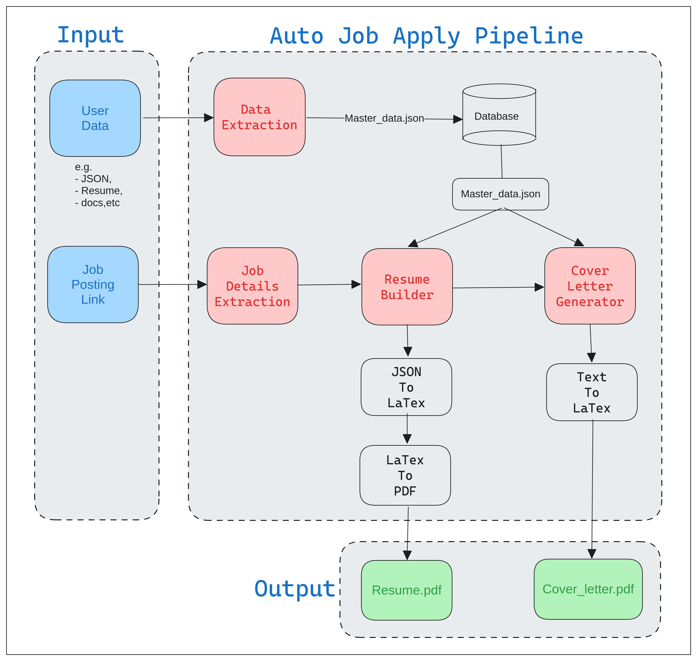

# LLM Pipeline For Job Automation



Project source can be downloaded from https://github.com/Ztrimus/job-llm.git

All other known bugs and fixes can be sent to following emails with the subject *"[BUG] JOB LLM"*. Reported bugs/fixes will be submitted to correction.
- szinjad@asu.edu
- abhilega@asu.edu

#### Author & Contributor List
- [Saurabh Zinjad - Ztrimus](https://linkedin.com/in/saurabhzinjad)
- [Amey Bhilegaonkar - ameygoes](https://www.linkedin.com/in/amey-bhilegaonkar/)


## Introduction:

### 1. Motivation: LLMs as Components in an ML Pipeline

Solving a task using machine learning methods requires a series of steps that often require large amounts of human effort or labor. Some examples of this are: 
- data collection
- data curation or something similar
- data labeling
- data augmentation, etc. 

Furthermore there might be more steps after the training the ML model, such as evaluation, explaining the behavior of the model,
interpreting model outputs, etc. Many of these steps are also often human labor intensive. In this project, we will investigate how to effectively use Large Language Models (LLMs) to automate various aspects of this pipeline.

### 2. Our Proposal
We're aiming to create a automated system that makes applying for jobs a breeze. Job hunting has many stages, and we see a chance to automate things and use LLM (Language Model) to make it even smoother. We're looking at different ways, both the usual and some new ideas, to integrate LLM into the job application process. The goal is to reduce how much you have to do and let LLM do its thing, making the whole process easier for you.

## Get Started and Setup
1. Prerequisites
    - OS: Linux(Ubuntu 22.04)
    - Python - 3.10.12
    - OpenAI API key (Store in your environment variable called `OPENAI_API_KEY`)
2. Create python environment (`python -m venv .env` or conda or etc.)
3. Install [Poetry package](https://python-poetry.org/docs/basic-usage/) (dependency management and packaging tool)
    ```bash
    > pip install poetry
    ```
4. Install all required packages. Refer [pyproject.toml](./pyproject.toml) or [poetry.lock](./poetry.lock) for list of packages.
    ```bash
    > poetry install
    ```
5. We recommand using poetry, if above command not working, we provided requirements.txt file.
    ```
    bash
    > pip install -r requirements.txt
    ```
5. If you are on linux you also need to install following thing to convert latex to pdf.
    ```bash
    > sudo apt-get install texlive-latex-base texlive-fonts-recommended texlive-fonts-extra
    ```
## Run Code
```bash
>>> python main.py --url "JOB_POSTING_URL" --master_data="JSON_USER_MASTER_DATA"
```
- Refer following example
```bash
>>> python main.py --url "https://www.squarespace.com/careers/jobs/5369485?ref=Simplify" --master_data="master_data/saurabh_profile.json"
```
## Resources 

## References
- https://www.overleaf.com/latex/templates/jakes-resume-anonymous/cstpnrbkhndn

## Bugs :

## Limitation and Further growth : 
## TODO:
- Evaluation of generated resumes: metrics can be
    - **Content Preservation**: overlap b/w keywords from resume and master data.
    - **Goodness of resume for certain job**: Overlap b/w generated resume and job description.
- Streamlit app development
